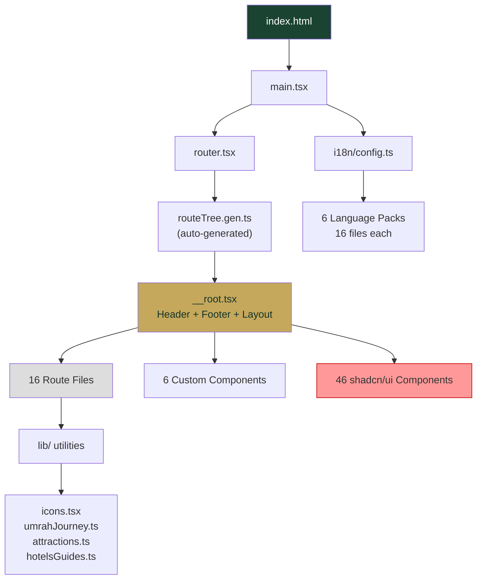

# تحليل تقني شامل للموقع — استعداداً للإطلاق التجاري

> [!IMPORTANT]
> هذا التقرير يركز على **الناحية البرمجية فقط** (الأداء، البنية، الأمان، جودة الكود، SEO التقني) وليس على المحتوى أو الميزات.

---

## 1. ملخص تنفيذي

| البند | الحالة | التقييم |
|---|---|---|
| البناء (Build) | ✅ ينجح | تحذيرات حجم الحزمة |
| TypeScript | ⚠️ خطأ واحد | خطأ كتابي في `tips.tsx` |
| أمان الكود | ✅ جيد | لا توجد ثغرات خطيرة |
| SEO التقني | ⚠️ جزئي | يحتاج تحسينات |
| الأداء | ⚠️ متوسط | صور ضخمة + حزمة كبيرة |
| إمكانية الوصول (A11y) | ⚠️ جزئي | بعض `aria-label` بالعربية فقط |
| الدولية (i18n) | ✅ جيد | 6 لغات مدعومة بالكامل |
| كود ميت / ملفات غير مستخدمة | ⚠️ متوسط | 46 مكون UI مثبّت، أغلبها غير مستخدم |

---

## 2. 🔴 مشاكل حرجة (يجب إصلاحها قبل الإطلاق)

### 2.1 خطأ TypeScript في [tips.tsx](file:///c:/Users/Masoud/WebstormProjects/hajj-umrah-guide-lite/src/routes/tips.tsx#L121-L123)

```diff
  <PageHeader
-   eyrow={t("eyebrow")}
    eyebrow={t("eyebrow")}
    title={t("title")}
    description={t("description")}
  />
```

> [!CAUTION]
> خاصية `eyrow` خطأ كتابي ولا تنتمي لواجهة `PageHeader`. يجب حذفها.

### 2.2 نموذج التواصل وهمي (Mock) — [contact.tsx](file:///c:/Users/Masoud/WebstormProjects/hajj-umrah-guide-lite/src/routes/contact.tsx#L44-L55)

```typescript
const handleSubmit = (e: React.FormEvent) => {
  // ...
  setLoading(true);
  // Mocking API call ← ⚠️ لا يوجد إرسال فعلي
  setTimeout(() => {
    setLoading(false);
    setSubmitted(true);
  }, 1200);
};
```

> [!CAUTION]
> النموذج يعرض رسالة نجاح **بدون إرسال أي بيانات فعلياً**. المستخدم سيظن أن رسالته أُرسلت بينما لم يحدث شيء. يجب ربطه بـ backend API أو خدمة مثل Formspree/EmailJS، أو إزالته مؤقتاً.

### 2.3 معلومات تواصل وهمية في [contact.tsx](file:///c:/Users/Masoud/WebstormProjects/hajj-umrah-guide-lite/src/routes/contact.tsx#L84-L99)

- البريد `support@morshid.app` — هل هو فعّال؟
- الهاتف `+966 50 000 0000` — رقم وهمي واضح

> [!WARNING]
> هذا يقلل من مصداقية الموقع تجارياً. يجب استبدالها ببيانات حقيقية.

### 2.4 مكوّن تبديل اللغة معطّل — [LanguageSwitcher.tsx](file:///c:/Users/Masoud/WebstormProjects/hajj-umrah-guide-lite/src/components/LanguageSwitcher.tsx#L26)

```typescript
return null; // اخفاء زر تغيير اللغة لبعض الوقت
```

> [!CAUTION]
> المكوّن يعيد `null` دائماً، مما يعني أن المستخدم **لا يمكنه تغيير اللغة نهائياً** رغم أن النظام يدعم 6 لغات. يجب إعادة تفعيله أو حذف الكود المعطّل.

### 2.5 صفحة الخطأ الاحتياطية بالإنجليزية فقط — [error-page.ts](file:///c:/Users/Masoud/WebstormProjects/hajj-umrah-guide-lite/src/lib/error-page.ts)

صفحة الخطأ HTML الثابتة (`renderErrorPage`) مكتوبة بالإنجليزية بالكامل (`This page didn't load`) ولا تتوافق مع طبيعة الموقع العربي.

---

## 3. 🟡 مشاكل متوسطة (مهمة للإطلاق التجاري)

### 3.1 حجم حزمة JS كبير — 544 KB

```
dist/assets/index-CMy2h7Sm.js   544.03 kB │ gzip: 152.25 kB
```

> [!WARNING]
> الحزمة أكبر من 500 KB وهي كتلة واحدة بدون code-splitting. هذا يؤثر على:
> - **وقت التحميل الأول (FCP)** خاصة على شبكات 3G
> - **تقييم Core Web Vitals** في Google
> - **تجربة المستخدم** على الأجهزة الضعيفة

**الحل المقترح:**
- تفعيل `React.lazy()` و code-splitting بحسب المسارات
- نقل `recharts` إلى تحميل كسول (lazy) لأنها مكتبة ثقيلة وغير مستخدمة في الصفحة الرئيسية
- إزالة مكونات `shadcn/ui` غير المستخدمة (أنظر القسم 3.2)

### 3.2 مكونات shadcn/ui غير مستخدمة (46 مكوّن مثبّت)

المكونات المثبّتة في [src/components/ui/](file:///c:/Users/Masoud/WebstormProjects/hajj-umrah-guide-lite/src/components/ui) تشمل مكونات ثقيلة أغلبها **غير مستخدم**:

| مكوّن غير مستخدم (غالباً) | الحجم |
|---|---|
| `sidebar.tsx` | 24 KB |
| `chart.tsx` | 10.5 KB |
| `menubar.tsx` | 8.5 KB |
| `context-menu.tsx` | 7.4 KB |
| `dropdown-menu.tsx` | 7.6 KB |
| `calendar.tsx` | 7.2 KB |
| `carousel.tsx` | 6.2 KB |
| `command.tsx` | 4.9 KB |
| + 20 مكوّن آخر... | |

> [!TIP]
> يجب إزالة المكونات غير المستخدمة. Tailwind يقوم بـ tree-shaking للـ CSS لكن الـ JS يبقى في الحزمة إذا لم تُحذف الملفات.

### 3.3 صور PNG ضخمة بدون ضغط

| ملف | الحجم |
|---|---|
| `kaaba.png` | **2.0 MB** |
| `article1.png` | **1.8 MB** |
| `article3.png` | **1.7 MB** |
| `article2.png` | **1.3 MB** |

**المجموع لصور PNG فقط: ~6.9 MB**

> [!WARNING]
> هذه الصور تُحمّل من `public/` بدون أي معالجة من Vite. يجب:
> - تحويلها إلى **WebP** أو **AVIF** (توفير 60-80% من الحجم)
> - إضافة `loading="lazy"` و `width`/`height` لتجنب CLS
> - استخدام `<picture>` مع srcset للأحجام المختلفة

### 3.4 خطوط Google Fonts ثقيلة — حمل متعدد

في [index.html](file:///c:/Users/Masoud/WebstormProjects/hajj-umrah-guide-lite/index.html#L22) يتم تحميل **10 عائلات خطوط** من Google Fonts في استدعاء واحد:

```
Amiri, Inter, Lora, Noto Nastaliq Urdu, Noto Sans Arabic, 
Playfair Display, Plus Jakarta Sans, Reem Kufi, Source Sans 3, Tajawal
```

> [!NOTE]
> كل هذه الخطوط تُحمّل **مباشرة عند فتح الصفحة** بغض النظر عن اللغة المختارة. يجب:
> - تحميل خطوط اللغة الحالية فقط
> - استخدام `font-display: swap` (موجود عبر `&display=swap` ✅)
> - استضافة الخطوط محلياً بدلاً من Google CDN لتحسين الخصوصية

### 3.5 تحديث `<title>` يدوياً عبر `document.title`

كل صفحة تقوم بتحديث العنوان يدوياً في `useEffect`:

```typescript
// في index.tsx, contact.tsx, umrah.tsx...
useEffect(() => {
  document.title = `${t("title")} — ${brandName}`;
}, [t]);
```

بينما TanStack Router يدعم `head()` أصلاً (وهو مستخدم بالفعل). المشكلة:
- العناوين في `head()` **ثابتة بالعربية** (`"مرشد — دليل المعتمر"`)
- العناوين في `useEffect` **ديناميكية ومترجمة**
- هناك تعارض: `head()` يعمل قبل `useEffect`

**الحل:** الاعتماد على آلية واحدة فقط — إما `head()` مع دعم الترجمة أو `useEffect`.

### 3.6 مؤقت مواقيت الصلاة يعمل كل ثانية

في [PrayerTimes.tsx](file:///c:/Users/Masoud/WebstormProjects/hajj-umrah-guide-lite/src/components/PrayerTimes.tsx#L77-L82):

```typescript
useEffect(() => {
  const timer = setInterval(() => {
    setCurrentTime(new Date()); // ← كل ثانية!
  }, 1000);
  return () => clearInterval(timer);
}, []);
```

ثم يُعاد **حساب كامل** لمواقيت الصلاة كل ثانية (`calculatePrayerTimes`) رغم أنها تتغير مرة واحدة فقط في اليوم.

> [!TIP]
> افصل بين تحديث العداد التنازلي (كل ثانية) وحساب المواقيت (مرة واحدة يومياً أو عند تغيير المدينة).

### 3.7 خادم التطوير مفتوح على جميع الشبكات

في [vite.config.ts](file:///c:/Users/Masoud/WebstormProjects/hajj-umrah-guide-lite/vite.config.ts#L27-L31):

```typescript
server: {
  host: "0.0.0.0",        // ← مفتوح لأي عنوان IP
  allowedHosts: true,      // ← يقبل أي host
}
```

> [!WARNING]
> هذا آمن لبيئة التطوير (Lovable/Replit) لكن يجب عدم نشره في بيئة إنتاج.

---

## 4. 🟢 نقاط إيجابية

### ✅ بنية المشروع
- بنية واضحة ومنظمة: `components/`, `hooks/`, `lib/`, `routes/`, `i18n/`
- فصل جيد بين المكونات والمنطق
- استخدام TanStack Router مع file-based routing
- Type-safe routing مع `createFileRoute`

### ✅ نظام التصميم (Design System)
- استخدام متقدم لـ **OKLCH color space** مع متغيرات CSS
- نظام Dark/Light mode متكامل مع persistence
- Custom Tailwind utilities (`@utility`) لأنماط متكررة
- دعم `prefers-reduced-motion` لتقليل الحركة

### ✅ دعم اللغات (i18n)
- 6 لغات مدعومة (ar, en, id, tr, fr, ur)
- 16 ملف ترجمة لكل لغة — تغطية شاملة
- Lazy loading للترجمات عبر `resourcesToBackend`
- خطوط مخصصة لكل لغة (ممتاز!)
- دعم RTL/LTR ديناميكي

### ✅ الأمان
- لا يوجد `dangerouslySetInnerHTML` في الكود المخصص (فقط في `chart.tsx` من shadcn)
- لا توجد استدعاءات API أو `fetch` — موقع ثابت بالكامل
- لا توجد أسرار أو مفاتيح API مكشوفة
- لا يوجد `console.log` متروك (ممتاز)
- لا يوجد `TODO` أو `FIXME` متروك
- React `escapeValue: false` في i18next آمن لأن React يقوم بالحماية من XSS تلقائياً

### ✅ معالجة الأخطاء
- `ErrorComponent` و `NotFoundComponent` مُعرّفان في الـ root layout
- Error capture للأخطاء العالمية (`error-capture.ts`)
- Lovable error reporting مدمج
- `Suspense` fallback للتحميل الكسول

### ✅ إعدادات البناء
- Vite 8 + React 19 — أحدث الإصدارات
- ESLint + Prettier مُعدّان
- TypeScript strict mode مفعّل
- `bunfig.toml` يفرض حد أدنى 24 ساعة لإصدارات الحزم (حماية من هجمات supply-chain)

---

## 5. SEO التقني

| البند | الحالة | ملاحظة |
|---|---|---|
| `<title>` | ⚠️ | ثابت بالعربية في `head()` + ديناميكي في `useEffect` — تعارض |
| `<meta description>` | ⚠️ | ثابت بالعربية فقط في `head()` |
| Open Graph | ✅ | `og:title`, `og:description`, `og:image`, `og:type` |
| `<h1>` فريد | ✅ | كل صفحة لها عنوان واحد |
| Semantic HTML | ✅ | `<header>`, `<main>`, `<footer>`, `<nav>`, `<article>`, `<section>` |
| Canonical URL | ❌ | غير موجود |
| `robots.txt` | ❌ | غير موجود |
| `sitemap.xml` | ❌ | غير موجود |
| `manifest.json` (PWA) | ❌ | غير موجود |
| Structured Data (JSON-LD) | ❌ | غير موجود |
| `hreflang` لتعدد اللغات | ❌ | غير موجود رغم دعم 6 لغات |

> [!IMPORTANT]
> لموقع تجاري يستهدف جمهوراً دولياً، يجب إضافة `robots.txt`, `sitemap.xml`, `hreflang` tags, و `canonical` URL كحد أدنى.

---

## 6. إمكانية الوصول (Accessibility)

| البند | الحالة | ملاحظة |
|---|---|---|
| `aria-label` | ⚠️ | موجود لكن بعضه بالعربية فقط (`القائمة الرئيسية`, `إغلاق القائمة`) |
| Focus visible | ✅ | `focus-visible:ring-2` مطبّق على العناصر التفاعلية |
| Color contrast | ✅ | ألوان OKLCH مدروسة |
| Keyboard navigation | ⚠️ | القائمة المنسدلة للأقسام تعمل بـ hover فقط (`group-hover:`) — لا يمكن الوصول إليها بلوحة المفاتيح |
| `alt` للصور | ✅ | موجود لمعظم الصور |
| `prefers-reduced-motion` | ✅ | مدعوم |

---

## 7. قائمة المهام للإطلاق

### 🔴 حرجة (يجب إصلاحها)
- [ ] إصلاح خطأ TypeScript في `tips.tsx` (حذف `eyrow`)
- [ ] ربط نموذج الاتصال بخدمة حقيقية أو إزالته
- [ ] استبدال بيانات التواصل الوهمية
- [ ] إعادة تفعيل `LanguageSwitcher` أو حذف دعم تعدد اللغات
- [ ] ترجمة صفحة الخطأ الاحتياطية

### 🟡 مهمة (للإطلاق التجاري الاحترافي)
- [ ] تطبيق code-splitting (lazy routes)
- [ ] ضغط وتحويل صور PNG إلى WebP
- [ ] إضافة `robots.txt` و `sitemap.xml`
- [ ] إضافة `canonical` و `hreflang` tags
- [ ] تحميل خطوط اللغة الحالية فقط (وليس جميعها)
- [ ] فصل حساب مواقيت الصلاة عن تحديث العداد
- [ ] إزالة مكونات shadcn/ui غير المستخدمة
- [ ] توحيد آلية تحديث `<title>`
- [ ] جعل القائمة المنسدلة في الـ navbar قابلة للوصول بلوحة المفاتيح

### 🟢 تحسينات مستقبلية
- [ ] إضافة `manifest.json` لدعم PWA (تثبيت كتطبيق)
- [ ] إضافة JSON-LD structured data
- [ ] إضافة Service Worker للعمل بدون إنترنت
- [ ] تحسين Lighthouse score (حالياً متأثر بحجم الحزمة والصور)
- [ ] استضافة الخطوط محلياً بدلاً من Google Fonts
- [ ] إزالة اعتماد Lovable (`lovable-error-reporting.ts`) قبل الإطلاق المستقل
- [ ] حذف ملفات Replit (`replit.md`, `.replit`)

---

## 8. البنية التقنية



---

## 9. إحصائيات الكود

| البند | القيمة |
|---|---|
| ملفات المصدر (src/) | ~70 ملف |
| مسارات (Routes) | 16 صفحة + 2 dynamic |
| مكونات مخصصة | 6 |
| مكونات shadcn/ui | 46 |
| Hooks مخصصة | 2 |
| لغات مدعومة | 6 (ar, en, id, tr, fr, ur) |
| ملفات ترجمة | 96 (16 × 6) |
| حجم Build CSS | 130 KB (gzip: 20 KB) |
| حجم Build JS | 544 KB (gzip: 152 KB) |
| صور public/ | ~6.9 MB PNG + ~17 MB JPG تقريباً |
